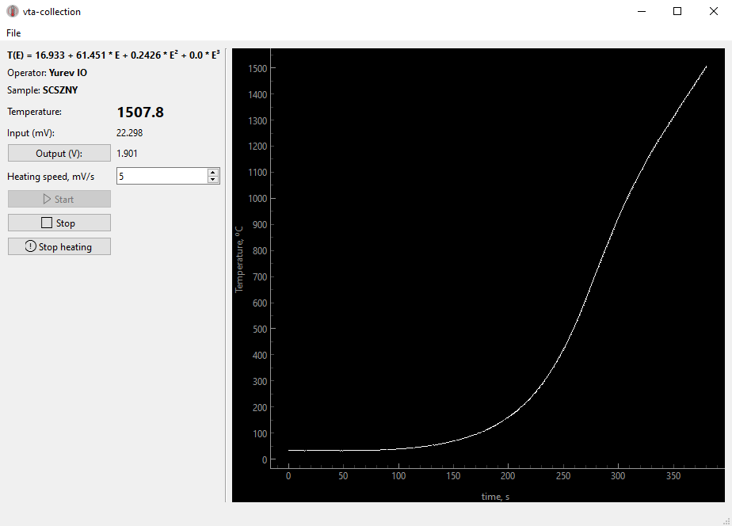

[](https://doi.org/10.5281/zenodo.15757789)
# VTA Collection Application


## Overview

The VTA Collection Application is a desktop software developed in Python using the PySide6 framework. It is designed for collecting, processing, and visualizing Visual Thermal Analysis (VTA) data from connected hardware instruments.

This application communicates with hardware modules (Adam4011, Adam4021, Adam4520) via serial interfaces, enabling real-time data acquisition, calibration processing, and measurement management.



## Features

- **Hardware Integration:** Supports Adam series instruments for precise data collection.
- **Real-time Visualization:** Live plotting of EMF, temperature, and output signals.
- **Calibration Support:** Polynomial calibration with user-editable coefficients.
- **User-friendly Interface:** Qt-based GUI with dialogs for configuration, measurement setup, and about information.
- **Data Management:** Organizes measurements with metadata, saves data in compressed zip format.
- **Extensibility:** Modular design allows adding new instruments and customization.

## Installation

### Requirements

- Python 3.11+
- Poetry package manager

### Setup

1. Clone the repository:
   ```bash
   git clone https://gitflic.ru/project/i-o-yurev/vta-collection.git
   cd vta-collection
   ```

2. Install dependencies via Poetry:
   ```bash
   poetry install
   ```

3. (Optional) Activate virtual environment:
   ```bash
   poetry shell
   ```

## Usage

Run the application with:
```bash
poetry run python -m vta_collection
```

## Configuration

- Application settings are managed via the Configuration dialog.
- Serial ports and hardware addresses must be set correctly to communicate with devices.
- Calibration polynomials can be enabled and adjusted.

## Development

- The project uses pre-commit hooks for linting (ruff), formatting, type checking (mypy), import sorting (isort), and commit message convention (commitizen).
- Developers should run:
  ```bash
  pre-commit install
  ```
  to enable hooks locally.
- The project is compatible with Python 3.11 and above.

## Testing

- Currently, no automated tests are included.
- Contributions to add testing are welcome.

## Contribution and Support

- Issues and feature requests can be opened on the project repository.
- Contact: i.o.yurev@yandex.ru

## License

Licensed under the MIT License.


## Acknowledgements

This project leverages several powerful open-source libraries:

- [PySide6](https://doc.qt.io/qtforpython/)
- [loguru](https://github.com/Delgan/loguru)
- [pyserial](https://pyserial.readthedocs.io/)
- [pydantic](https://docs.pydantic.dev/)
- [pglive](https://github.com/domarm-comat/pglive)

Additionally, ready-made Windows builds are available for convenient installation and use, eliminating the need for manual setup of Python environment or dependencies.

Precompiled Windows package can be downloaded from the project's releases page:
- https://gitflic.ru/project/i-o-yurev/vta-collection/releases

The hardware interaction is based on ADAM series modules by Advantech:
- Advantech ADAM 4011
- Advantech ADAM 4021
